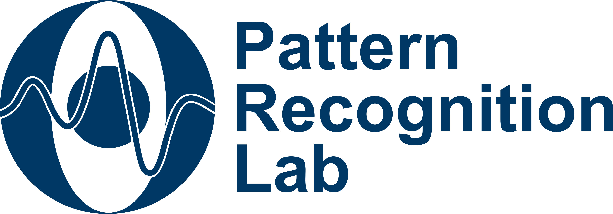

# Thesis Topic: LLM-Centric Framework for Ontology-Driven SPARQL Query Generation in RAG for DICOM Databases
## Collaborators:
<div align="center">
  
  &nbsp;&nbsp;&nbsp;&nbsp;
  
  &nbsp;&nbsp;&nbsp;&nbsp;
  
</div>

> **Transforming natural language questions into precise SPARQL queries using Large Language Models and ontologies.**  
> This repository contains the full codebase, datasets, and experimental resources used in my M.Sc. thesis project at Pattern Recognition Lab in FAU Erlangen-Nürnberg.
> It was the collaboration betwee the Friedrich-Alexander-Universität Erlangen-Nürnberg (FAU) and SOHARD Software GmbH.

---

## HPC Note

> All experiments were originally conducted on an **HPC (High Performance Computing)** system.  
> When reproducing results locally, please **check and update file paths** inside the scripts — some directory structures were altered during data migration.

---

## Author

**Vicky Vicky**  
*M.Sc. in Artificial Intelligence*  
[Lehrstuhl für Mustererkennung (Informatik 5)](https://www5.cs.fau.de/)  
Department Informatik,  
**Friedrich-Alexander-Universität Erlangen-Nürnberg (FAU)**

---

## Supervisors

- **Dr. Tri-Thien Nguyen, M.Sc.**  
- **Dr. rer. medic. Soroosh Tayebi Arasteh, M.Sc.**  
- **Dr.-Ing. Andreas Maier**  
- **M.A. Detlef Grittner (CTO)**  
- **Dipl. Inf. Peter Feltens (CEO)**  

---

## Project Overview

This repository contains all assets required to **reproduce and explore** the experiments conducted as part of the thesis:

> *LLM-Centric Framework for Ontology-Driven SPARQL Query Generation in RAG for DICOM Databases.*

The project explores how **Large Language Models (LLMs)** can be fine-tuned and integrated with **RAG (Retrieval-Augmented Generation)** pipelines to generate **ontology-compliant SPARQL queries** from **natural language inputs** — particularly for **DICOM medical imaging databases**.

---

## Repository Structure

| Folder/File | Description |
|--------------|-------------|
| **`requirements.txt`** | List of Python dependencies required to reproduce the experiments. |
| **`Experiments_Scripts/`** | Contains all four experiment scripts, including multi-GPU fine-tuning code. |
| **`Datasets/`** | Includes ontology data and fine-tuning datasets used throughout the experiments. |
| **`HPC_Scripts/`** | Contains all SLURM job submission scripts used for HPC-based training and inference. |
| **`Fine_Tuning_Weights/`** | Saved model weights and helper scripts (e.g. `remove_bad_keys.py` for key correction). |
| **`Sparql_Results/`** | Generated SPARQL results and experiment outputs in `.txt` format. |

---

## Datasets and Ontologies

- **`onto_ver_7.owl`** — Base ontology (used as RAG document in Experiment 1).  
- **`onto_ver_7_semantics.owl`** — Enriched ontology version with `rdfs:comment` annotations for contextual semantics.  
- **`ontology_dump.txt`** — Simplified ontology used within the *Ontology-Based SPARQL Repair (OBSR)* module (Experiment 4).  
- **`NL2SPARQL_FT_DATA_1600.json`** — Fine-tuning dataset containing 1,600 NL–SPARQL pairs.


---

## How to Reproduce

1. **Clone the repository**
   ```bash
   git clone https://github.com/<your-username>/nl2sparql-rag.git
   cd nl2sparql-rag
